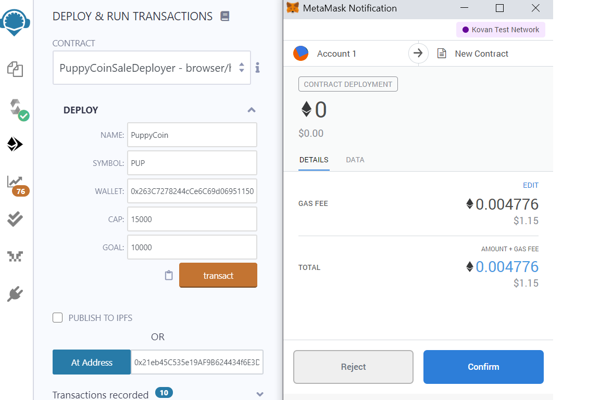
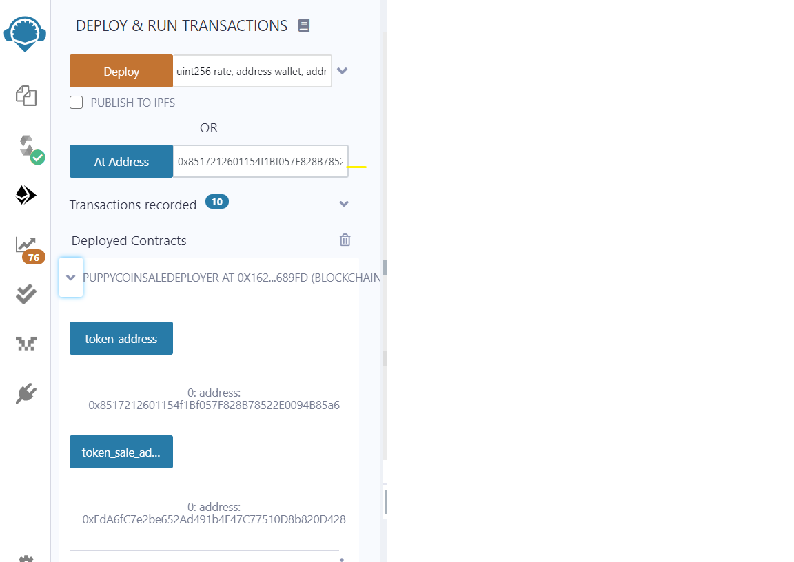
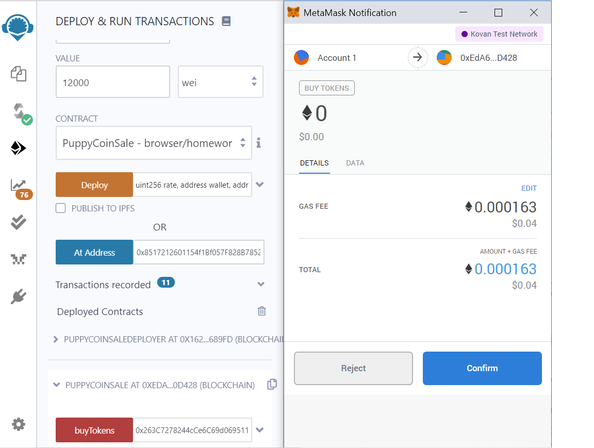
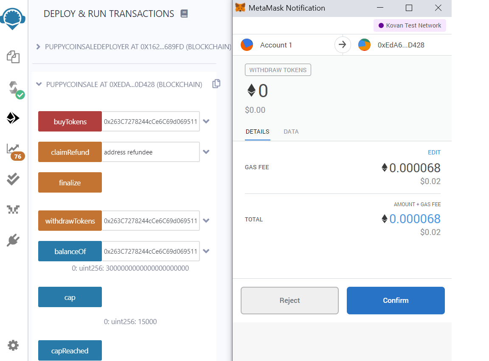
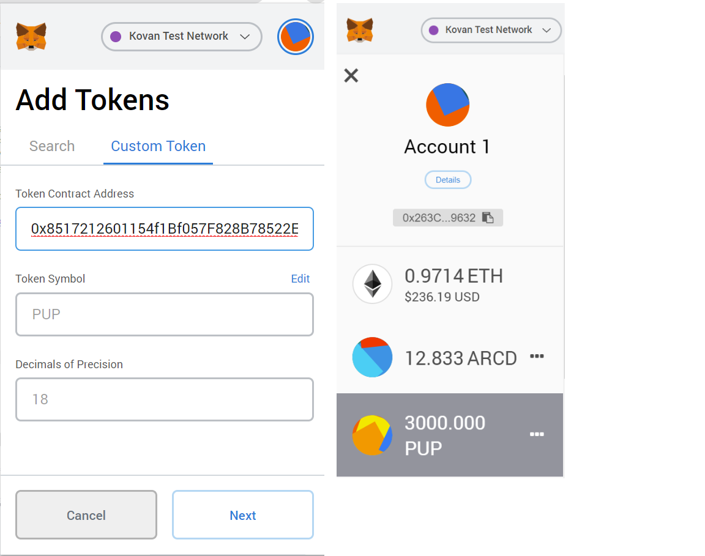
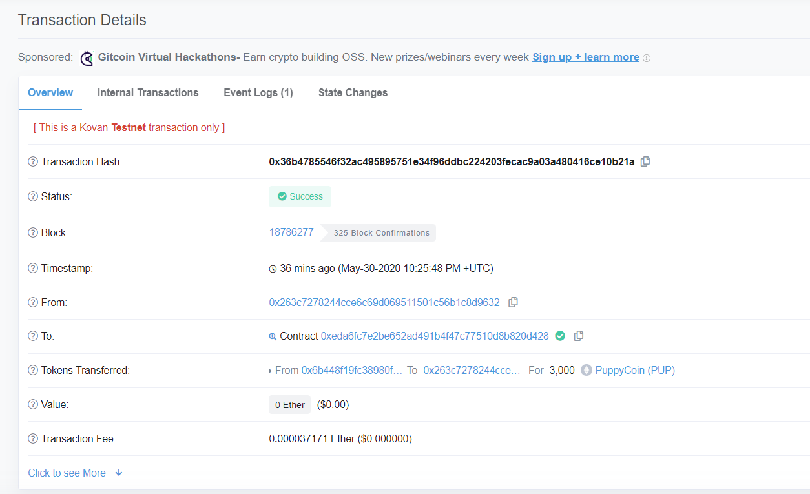
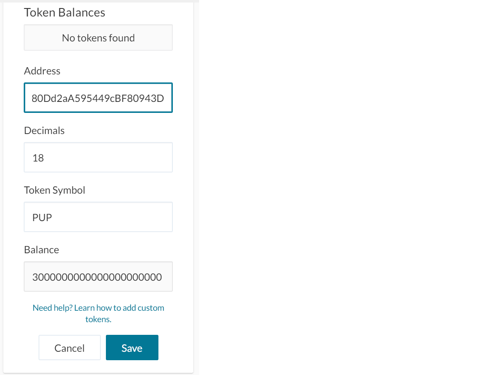

# ERC20 Token Crowdsale
## Overview
---
For this assignment, we assume that we have been given the green light from the necessary legal bodies to create a crowdsale open to the public. These are the requirements that must be met: 
1. Set a `cap` to limit the maximum amount of `Ether` the company can raise. 
2. Enable refunds
3. Stablish a `goal` for the minimum amount of `Ether` the company must raise
3. Specify a start and end time for the crowdsale

## Designing the smart contracts
To develop the smart contracts we refer to the [OpenZeppelin](https://openzeppelin.com/contracts) library.

 The `PuppyCoin.sol` contract inherits standards from `ERC20Mintable` and `ERC20Detailed`. Since Ethereum's default for decimals is 18, this parameter is hardcoded.  

 The `PuppyCoinCrowdsale.sol` contract inherits from the following standards:
* Crowdsale: sell tokens in exchange for Ether. 
* MintedCrowdsale: tokens will be minted as purchases are made. 
* CappedCrowdsale: adds a cap to the crowdsale
* TimedCrowdsale: specify start and end time
* RefundablePostDeliveryCrowdsale: tokens can be withdrawn or refunds can be claimed once the crowdsale has ended. 

Inside this contract we can set parameters for all of the features of the crowdsale. Notice that only the `rate`, `startTime`, and `endTime` parameters are hardcoded. This contract can be customized further, but security risks should be considered at all times. 

One of the most important things to cosider when creating a crowdsale is the `rate`. Notice that in the code the `rate = .25e18`. This means that one token will be issued for every 4 wei. It is very important to understand how the conversation rate works in `Solidity`.

## Testing the Crowdsale
We can test the crowdsale using the local network or one of the testnets. I use Kovan to test and deploy the contracts. In order to use the testnets, however, the first thing we need to do is request some test Ether from the faucets. Then follow these steps to execute the crowdsale: 

1\. Deploy `PuppyCoinSaleDeployer` contract. The crowdsale's parameters are stablished here. 

2\. Select `PuppyCoinSale` contract. Paste `token_sale_address` into `At Address` 

3\. Switch to `PuppyCoin` contract. Paste `token_address` into `At Address` button 

The crowdsale should be live now. 

## Buy and withdraw tokens. 
If we are using a local network to test the crowdsale, we can use different wallets to buy tokens as we can get unlimited Ether from `Ganache`. Since I am limited on test Ether, I use a single account to both sell and buy tokens. The steps to follow are the same for both the local network or testnet. 

1\. Select the `PuppyCoinSale` contract and use the `buyTokens` function. Remember that in Solidity, math is done in the smallest of units, wei. Also, don't forget about the `rate` before deciding on the amount of Ether to send. 

2\. Tokens can be widthdrawn only when the crowdsale has been finalized by its owner. Paste the buyer's wallet address into the `withdrawTokens` button to retrieve tokens.

 

3\. Using Metamask, paste the `token_address` to add the custom token. Make sure to be in the buyer's wallet. Tokens should be shown now. 

4\. The recent transactions should also be visible on the Kovan tesnet scanner 

5\. Custom tokens can also be added to MyCrypto (note: This only worked during local network tests) 

